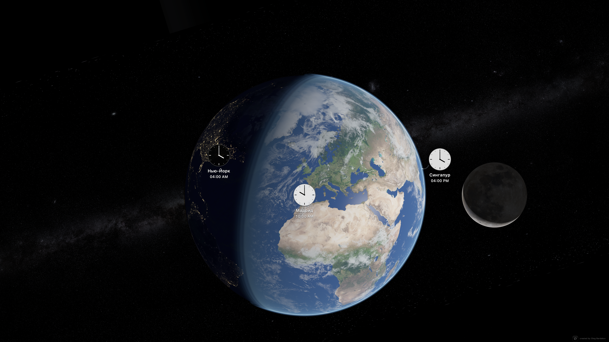

# Solstice — Live Earth Screen Saver for macOS

[](https://github.com/Oleg-Bar/Solstice/releases/latest)
[](https://github.com/Oleg-Bar/Solstice/releases/latest)
[](https://github.com/Oleg-Bar/Solstice/releases/latest)
[](https://www.swift.org/)



Solstice is a native macOS screen saver that renders a living Earth with real-time sunlight, city lights, clouds, the Moon's current phase and observer-dependent position, and local clocks for the cities that matter to you.

## Download

### [Download Solstice 1.10 for Apple silicon](https://github.com/Oleg-Bar/Solstice/releases/download/v1.10/Solstice-1.10-macOS-Apple-Silicon.dmg)

One file is all you need: **`Solstice-1.10-macOS-Apple-Silicon.dmg`** (about 41 MB).

Requirements: an Apple-silicon Mac (M1 or newer) running macOS 13 or later. The current release was verified on macOS Tahoe 26.6.1.

> The public build is currently ad-hoc signed because the project does not yet have an Apple Developer ID certificate. macOS may ask you to confirm the first launch. Never disable Gatekeeper globally.

## Install and configure

1. Download the DMG using the button above.
2. Open `Solstice-1.10-macOS-Apple-Silicon.dmg`.
3. Drag **Solstice** onto **Applications**.
4. Eject the Solstice disk image and open **Solstice** from Applications.
5. If macOS says the developer cannot be verified, Control-click Solstice, choose **Open**, and confirm. Alternatively, use **System Settings → Privacy & Security → Open Anyway** only for the DMG downloaded from this repository.
6. In the Solstice window, select **Install**.
7. Open **System Settings → Wallpaper → Screen Saver**, scroll to **Other**, and choose **Solstice**.
8. Open **System Settings → Lock Screen** to choose the idle delay. Set the password requirement to **Immediately** if the session must lock as soon as the saver starts.

Use **Start and Lock** in the Solstice app when you want the animation to appear before the protected macOS login screen. The standard macOS **Lock Screen** command goes directly to the login screen and does not launch third-party screen savers.

## What Solstice does

- Renders daylight, night, city lights, clouds, atmosphere, and the Milky Way with Metal.
- Calculates the Moon's phase, distance, horizon visibility, and apparent orientation for the observer.
- Shows localized clocks for user-selected cities, including time zones and daylight-saving transitions.
- Supports Retina and 5K output while running at a battery-conscious 1 frame per second.
- Can determine an approximate current city through `ipwho.is`, but only after explicit permission.
- Runs locally without accounts, advertising, analytics, or background services.

## Privacy

Astronomical calculations and rendering happen entirely on the Mac. The only optional network request is approximate IP-based city detection through `ipwho.is`. Solstice asks first, does not send precise device coordinates, and refreshes no more than once every 12 hours. Update checks run only when requested by the user.

## Uninstall completely

Open **Solstice** from Applications and choose **Uninstall Completely**. The app removes the installed screen saver, Solstice preferences, owned caches, saved state, and known legacy Terra user files, then moves itself to the Trash. The downloaded DMG remains in Downloads so you can remove it separately.

## Known macOS behavior

- macOS 26 Tahoe currently displays a generic blue tile for third-party `.saver` bundles even when custom thumbnails are present. The large live preview and full screen saver render correctly.
- macOS owns the login interface, idle delay, password timing, display sleep, and the standard Lock Screen command.
- Multi-display setups, Intel Macs, and macOS versions other than the verified environment require additional hardware testing.

## Verification and source

Solstice 1.10 passes 18 automated tests with 3,440 assertions and zero failures. The release DMG passes `hdiutil verify`; its packaged screen saver is identical to the tested build. See [validation details](Docs/Validation.md), [release notes](Docs/ReleaseNotes-1.10.md), and [asset credits](Docs/Assets.md).

Build locally:

```bash
bash Scripts/test.sh
bash Scripts/build.sh
```

Creating a distributable DMG additionally uses the standard macOS `hdiutil` and Finder tools:

```bash
bash Scripts/package-dmg.sh
```

The release is ad-hoc signed. Public commercial distribution should use an Apple Developer ID certificate and Apple notarization.

For help, use [GitHub Issues](https://github.com/Oleg-Bar/Solstice/issues). Security reports should follow [SECURITY.md](SECURITY.md). Third-party code and image rights are documented in [Resources/ThirdParty.txt](Resources/ThirdParty.txt) and [Docs/Assets.md](Docs/Assets.md). Copyright © 2026 Oleg Bardakov.

---

# Solstice — живая Земля на экране Mac

Solstice — нативная заставка для macOS: живая Земля с реальным солнечным освещением, ночными огнями, облаками, актуальной фазой и положением Луны и часами выбранных городов.

## Скачать

### [Скачать Solstice 1.10 для Mac с Apple Silicon](https://github.com/Oleg-Bar/Solstice/releases/download/v1.10/Solstice-1.10-macOS-Apple-Silicon.dmg)

Нужен только один файл: **`Solstice-1.10-macOS-Apple-Silicon.dmg`**, около 41 МБ. Поддерживаются Mac M1 и новее с macOS 13 или более новой системой.

> Сборка пока подписана локальной ad-hoc подписью: сертификата Apple Developer ID у проекта ещё нет. При первом запуске macOS может попросить дополнительное подтверждение. Не отключайте Gatekeeper полностью.

## Установка для новичка

1. Нажмите ссылку **Скачать** выше.
2. Откройте загруженный файл `Solstice-1.10-macOS-Apple-Silicon.dmg`.
3. Перетащите значок **Solstice** на значок **Applications / Программы**.
4. Извлеките диск Solstice и откройте приложение из папки «Программы».
5. Если macOS не может проверить разработчика, нажмите по Solstice с удержанием Control, выберите **Открыть** и подтвердите. Другой безопасный путь: **Системные настройки → Конфиденциальность и безопасность → Всё равно открыть** — только для DMG, загруженного из этого репозитория.
6. В окне Solstice нажмите **Установить**.
7. Перейдите в **Системные настройки → Обои → Заставка**, прокрутите до раздела **Другие** и выберите **Solstice**.
8. В разделе **Экран блокировки** задайте время запуска. Для немедленной защиты выберите запрос пароля **Сразу**.

Кнопка **Запустить и заблокировать** сначала показывает Solstice, а затем оставляет защищённый экран входа macOS. Обычная команда macOS **Заблокировать экран** сразу показывает окно входа и не запускает сторонние заставки.

## Возможности

- День, ночь, огни городов, облака, атмосфера и Млечный Путь на Metal.
- Фаза, расстояние, видимость над горизонтом и ориентация Луны для места наблюдателя.
- Часы выбранных городов с часовыми поясами и переходами на летнее время.
- Retina и 5K при экономной частоте один кадр в секунду.
- Необязательное определение примерного города по IP только после разрешения.
- Без аккаунта, рекламы, аналитики и фоновых служб.

## Приватность и удаление

Вычисления и графика работают локально. Единственный необязательный запрос — примерное определение города через `ipwho.is`; точные координаты Mac не отправляются. Проверка обновлений выполняется только по вашей команде.

Для полного удаления откройте Solstice в папке «Программы» и нажмите **Удалить полностью**. Приложение удалит заставку, свои настройки, кэши и сохранённое состояние, затем переместит себя в Корзину. DMG в папке «Загрузки» можно удалить отдельно.

## Для разработчиков

Проверка версии 1.10: 18 автоматических тестов, 3 440 проверок, 0 ошибок. Подробности находятся в [Validation.md](Docs/Validation.md), изменения версии — в [ReleaseNotes-1.10.md](Docs/ReleaseNotes-1.10.md), источники изображений — в [Assets.md](Docs/Assets.md).

---

## A small planet, quietly alive

Day crosses oceans. Cities glow. The Moon keeps its patient course. Solstice turns an idle screen into a calm reminder that every place — and everyone you miss — shares the same moving world.

## Маленькая планета, которая тихо живёт

День пересекает океаны. Города зажигают огни. Луна продолжает свой неспешный путь. Solstice превращает экран в спокойное напоминание: все дорогие нам места и люди живут на одной движущейся Земле.
