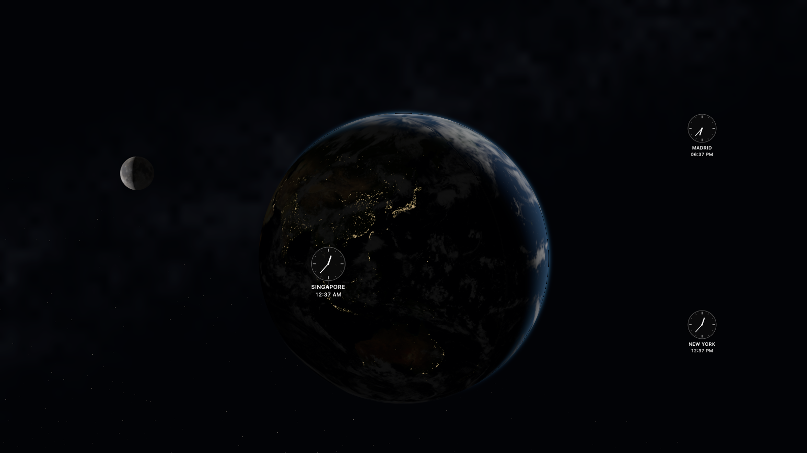

# Solstice

### Живая Земля на экране вашего Mac

**Весь мир. Один экран. Ваше время.**



Solstice превращает экран Mac в спокойный вид на нашу планету из космоса. Солнечный свет движется по поверхности Земли, города погружаются в ночь и зажигают огни, облака окружают планету, а Луна появляется в своей актуальной фазе и положении относительно наблюдателя.

Добавьте места, которые для вас важны: дом, семью, друзей или любимые города. Рядом с каждым городом появятся элегантные аналоговые часы, автоматически учитывающие часовой пояс, переход на летнее время и текущий день или ночь. Днём циферблат становится светлым, ночью — тёмным.

Solstice создана для Retina и 5K. Детализированная Земля, мягкое атмосферное свечение и ненавязчивый Млечный Путь образуют глубокую кинематографичную композицию без рекламы и визуального шума.

## Почему Solstice хочется оставить на экране

- Реальное освещение Земли для текущей даты и времени.
- Актуальные фаза, положение, ориентация и физический масштаб Луны.
- Часы выбранных городов с правильными часовыми поясами и переходом на летнее время.
- Светлый циферблат днём и тёмный ночью для каждого города.
- Автоматическая локализация названий городов на язык macOS.
- Автоматическое определение города по IP — только с разрешения пользователя.
- Детализированные локальные текстуры и нативный Metal-рендеринг для Retina и 5K.
- Один кадр в секунду — минимальная практическая частота для экономии батареи.
- Никаких аккаунтов, рекламы, фоновых служб, камеры, микрофона или доступа к паролям.

Все астрономические вычисления выполняются непосредственно на Mac. Единственное необязательное сетевое обращение — определение приблизительного города через `ipwho.is`; оно выполняется только после согласия, при запуске и затем не чаще одного раза в 12 часов.

**Текущая версия: Solstice 1.06.** Проект находится на этапе подготовки к распространению. Перед публичной продажей готовую сборку необходимо подписать сертификатом Apple Developer ID и нотариализировать.

Рабочее название движка и приложения — **Terra**, название проекта и продукта — **Solstice**.

## 1. Что создано

- `Terra.saver` — устанавливаемый модуль системной заставки.
- `Terra Preview.app` — отдельное приложение с тем же движком и состоянием сцены.
- `Terra.xcodeproj` — проект Xcode с целями TerraPreview, TerraSaver и TerraCoreTests.
- `Sources/` — все исходники Swift; `Resources/` — локальные карты Solar System Scope / NASA и Metal-шейдер.
- Проверки координат, Солнца, часовых поясов, видимости и перехода через горизонт.

## 2. Актуальный механизм macOS — проверено 05.09.2026

На машине разработки: **macOS Tahoe 26.6.1, Apple Silicon, Swift 6.3.3, Command Line Tools**. В актуальной таблице Apple указана Tahoe 26.6.2; на ней этот проект отдельно не тестировался. [Версии macOS](https://support.apple.com/es-es/109033).

Apple по-прежнему публикует **ScreenSaver framework / ScreenSaverView**. В установленном SDK класс не помечен deprecated. Он предоставляет создание вида, `startAnimation`, `stopAnimation`, `animateOneFrame` и системный preview. Поэтому выбран публичный `.saver` bundle с подклассом ScreenSaverView. Более нового публичного API для произвольной сторонней интерактивно отрисовываемой заставки в изученных документах Apple не найдено. Это вывод по доступной документации, а не обещание неизменности системного хоста.

Рендеринг — **Metal + MetalKit**, интерфейс — **AppKit**, язык — **Swift**. SceneKit исключён: Apple объявила его deprecated в Xcode 26. RealityKit подходит для многих 3D-приложений, но здесь Metal позволяет напрямую управлять освещением, частотой кадров и общим NSView внутри системного хоста без дополнительного движка сцены.

Источники: [Screen Saver](https://developer.apple.com/documentation/screensaver), [ScreenSaverView](https://developer.apple.com/documentation/screensaver/screensaverview), [MTKView](https://developer.apple.com/documentation/metalkit/mtkview), [Xcode 26 — SceneKit](https://developer.apple.com/documentation/Xcode-Release-Notes/xcode-26-release-notes).

### Ограничения современной macOS

- `.saver` — модуль, который загружает системный процесс; конкретное поведение миниатюры, нескольких дисплеев и блокировки зависит от версии macOS.
- Публичный API не даёт этой сцене гарантированного постоянного присутствия за системным окном входа и переходов, идентичных встроенным aerial-заставкам. Preview fullscreen также не блокирует Mac.
- Пароль после заставки, время запуска и отключение дисплея настраивает пользователь средствами macOS. Terra этих настроек не меняет.
- После обновления bundle системный хост может продолжить использовать старую загруженную версию. Закройте Settings; если повторный выбор не помогает, выйдите из учётной записи и войдите снова. Принудительно завершать системные процессы не требуется.
- Установка в системные настройки и фактический сеанс блокировки пока не проверены. Проверены загрузка bundle через ScreenSaver API и жизненный цикл двух экземпляров в локальном тестовом хосте. Это разные уровни проверки.

## 3. Требования

Основная цель — Mac M1 и новее. Минимальный deployment target — macOS 13; фактически проверена macOS 26.6.1. Более ранние системы требуют отдельной проверки.

Для запуска готового preview дополнительные инструменты не нужны. Для сборки достаточно актуальных Apple Command Line Tools (`xcode-select --install`, если отсутствуют). Для работы в IDE нужен полный Xcode 26 или новее. Сторонние пакеты не требуются.

На текущем Mac полный Xcode отсутствует. Установленный Swift Package Manager содержит несогласованные публичные и private-интерфейсы PackageDescription: его manifest не компилируется/не линкуется. Поэтому проверенный путь здесь — `Scripts/build.sh` и `Scripts/test.sh`, которые используют Swift напрямую. Системные файлы не изменялись. `Package.swift` оставлен как дополнительный вариант для исправной установки Swift 6 с XCTest; этот путь здесь не подтверждён. Основной проект для IDE — `Terra.xcodeproj`; его структура проверена, сборка именно через Xcode требует установленного Xcode.

## 4. Архитектура

```text
Terra/
├── Terra.xcodeproj          Xcode: Preview / Saver / Tests
├── Package.swift            дополнительный Swift Package
├── Sources/
│   ├── Core/
│   │   ├── Geometry.swift                 география, камера, горизонт
│   │   ├── SolarPositionCalculator.swift   Солнце и приближённая фаза Луны
│   │   ├── CitiesConfiguration.swift      города и местное время
│   │   └── SceneConfiguration.swift       параметры и debug timeline
│   ├── Rendering/
│   │   ├── EarthRenderer.swift            Metal pipeline и снимки
│   │   ├── EarthSceneView.swift           общий вид и цикл кадров
│   │   └── SceneAssets.swift              локальные ресурсы bundle
│   ├── UI/                                часы, подписи, скрытые города
│   ├── Preview/                           окно и панель настройки
│   └── Screensaver/                       адаптер ScreenSaverView
├── Resources/                             карты Solar System Scope / NASA + Scene.metal
├── Tests/                                 математические unit tests
├── Scripts/                               сборка, тесты, проверочный хост
├── Docs/                                  ТЗ, источники, QA и снимки
└── Build/products/                        готовые .app и .saver
```

Земля и облака — аналитические 3D-сферы: Metal вычисляет пересечение ортографического луча со сферой, нормаль, UV и освещение для каждого пикселя. Это полноценная объёмная поверхность, без полигональной сетки и её швов. `CameraBasis` используется и GPU, и проекцией городов. Долгота положительна на восток, север — +Y, Гринвич — +Z.

Ускоренное визуальное вращение реализовано движением точки обзора вокруг Земли. Направление Солнца вычисляется в земных координатах и не зависит от скорости обзора. Таким образом город на освещённой территории не становится ночным только из-за художественного вращения.

Терминатор использует UTC и приближение NOAA; между солнечными высотами приблизительно −6° и +4° — мягкий переход. Ночное свечение берётся из карты огней. Облака находятся на отдельной сфере радиусом 1.007. Атмосферный край — художественное приближение рассеяния.

Часы рисуются в плоскости экрана с центром в географической точке; соединительная линия появляется только при смещении из-за пересечения подписей. Перед горизонтом их прозрачность плавно меняется по smoothstep; внешний индикатор имеет дополняющую прозрачность. Его положение определяется направлением проекции города. Тонкая полупрозрачная дуга со скользящим бликом и наконечником связывает часы с краем Земли. При очень маленьком диске все часы вынесены наружу, чтобы не закрывать планету.

```text
┌───────────────────────────────────────────────────────┐
│               спокойное свободное пространство         │
│                                                       │
│       ◷                    ◷                 ☾        │
│  скрытый город       .─────────────.          Луна     │
│                     /    Земля      \                 │
│                    │  день → ночь    │                │
│                     \               /                 │
│                       '───────────'                   │
└───────────────────────────────────────────────────────┘
```

## 5. Запуск Preview

### Уже собранное приложение

Откройте `Build/products/Terra Preview.app` двойным щелчком в Finder.

Также можно дважды щёлкнуть `OPEN_TERRA.command` в корне проекта. Это короткий запускаемый файл без зависимости от клика по ссылке на `.app` внутри чата.

- Изменение размера окна — обычным перетаскиванием границы.
- Полный экран — зелёная кнопка окна или **Control–Command–F**.
- Добавить город — стеклянная кнопка в левом нижнем углу или **Command–N**.
- Удалить добавленный город — кнопка `−` рядом или меню **Terra Preview → Удалить город…**.
- Проверить обновление — маленький стеклянный значок перед подписью `created by Oleg Bardakov` в правом нижнем углу. Сетевой запрос выполняется только после нажатия.
- Завершить — **Command–Q**.

### Из исходников без Xcode

Откройте Terminal в папке `Terra` и выполните:

```bash
bash Scripts/preview.sh
```

### В Xcode

1. Откройте `Terra.xcodeproj`.
2. Выберите схему **TerraPreview**, устройство **My Mac**.
3. Нажмите **Command–R**.
4. Для математических тестов используйте **Command–U**.

Схема **TerraSaver** предназначена для сборки bundle; запускать `.saver` как приложение нельзя. Для разработки всегда используйте TerraPreview.

## 6. Сборка Release

В Terminal в папке `Terra`:

```bash
bash Scripts/test.sh
bash Scripts/build.sh
```

Результат:

```text
Build/products/Terra Preview.app
Build/products/Terra.saver
```

Скрипт собирает код для архитектуры текущего Mac, копирует локальные ресурсы, включает Hardened Runtime и проверяет подпись обоих bundle. Если в Keychain доступен сертификат `Developer ID Application`, он выбирается автоматически; его также можно указать через `TERRA_SIGN_IDENTITY`. Без сертификата создаётся локальная ad-hoc подпись с Hardened Runtime. На этой машине результат — arm64. Для M1 этого достаточно. Это не универсальный дистрибутив для всех Mac.

Полный Xcode, Apple Developer membership и App Store для локальной сборки этим способом не требуются. Ad-hoc подпись не является нотариализацией: её проверка подтверждает целостность локального bundle, но не гарантирует прохождение Gatekeeper при передаче на другой Mac. Для распространения потребуется отдельная подготовка Developer ID signing/notarization. Не отключайте Gatekeeper и не снимайте quarantine с неизвестных файлов.

Проект Xcode можно пересоздать после добавления файлов: `python3 Scripts/generate-xcode-project.py`. Обычное изменение существующих файлов генерации не требует.

## 7. Установка заставки

1. Сначала откройте Terra Preview и убедитесь, что сцена отображается.
2. В Finder откройте папку проекта → `Build` → `products`.
3. Дважды щёлкните **Terra.saver**.
4. Если macOS предложит выбор, установите **только для текущего пользователя**.
5. Откройте системные настройки и выберите Terra по шагам ниже.

Если двойной щелчок не открывает установщик, ручной вариант:

1. В Finder нажмите **Shift–Command–G**.
2. Введите `~/Library/Screen Savers/`.
3. Если папки `Screen Savers` нет, создайте её внутри своей `Library`.
4. Скопируйте туда **Terra.saver** целиком.
5. Закройте и снова откройте системные настройки.

Устанавливать `.app` в Applications не обязательно. Устанавливается только bundle `.saver`. Скрипты проекта не копируют файлы за пределы проекта и не меняют выбранную заставку автоматически.

## 8. Выбор в macOS Tahoe

По текущему руководству Apple: **Системные настройки → Обои → Заставка → Пользовательская (Custom) → Другие (Other)**. Найдите Terra, выберите её и запустите Preview. В некоторых локализациях подписи немного отличаются. На более ранних macOS «Заставка» может быть отдельным пунктом боковой панели.

Время до запуска и запрос пароля регулируются в **Экран блокировки**; запуск через угол — в **Рабочий стол и Dock → Активные углы**. [Инструкция Apple](https://support.apple.com/guide/mac-help/use-a-screen-saver-mchl4b68853d/mac).

## 9. Обновление

1. Измените исходники/конфигурацию, проверьте preview.
2. Закройте preview, завершите показ заставки и закройте System Settings.
3. Выполните тесты и `bash Scripts/build.sh`.
4. Замените установленную `Terra.saver` новым bundle через Finder.
5. Снова выберите её в System Settings. При сохранении старой версии выйдите и войдите в свою учётную запись.

## 10. Полное удаление и расположение файлов

1. Выберите другую системную заставку.
2. Завершите Terra Preview и закройте System Settings.
3. В Finder откройте `~/Library/Screen Savers/` и переместите **Terra.saver** в Корзину.
4. Если ранее выбрали установку для всех пользователей, проверьте `/Library/Screen Savers/Terra.saver`; удалить этот вариант могут только пользователи с соответствующими правами.
5. Если копировали `Terra Preview.app` в Applications, удалите эту копию.
6. Исходный проект можно сохранить для будущих изменений или также переместить в Корзину.

Внутри установленного `.saver` находятся исполняемый файл, ресурсы и подпись. Terra не создаёт собственной папки настроек или журналов вне проекта. macOS может сохранять обычные системные кэши/состояние выбора заставки; удалять системные файлы вручную не нужно.

## 11. Добавление и удаление городов

С отступом от левого нижнего края Preview расположены компактная стеклянная кнопка `Добавить город` и системная кнопка `−`. Добавление открывает нативный поиск AppKit с постоянно видимым списком совпадений. При каждом введённом символе сначала показываются совпадения с началом названия, затем вхождения внутри названия города, страны и часового пояса. `−` позволяет удалить любой выбранный город, включая исходные Madrid, Singapore и New York. Удалить нельзя только текущий город наблюдателя, определённый по IP; при смене IP-города прежний снова становится обычным управляемым городом.

Координаты и часовые пояса читаются из установленной в macOS базы `tzdb` (`zone.tab`). Видимые названия городов получает системный форматтер macOS из встроенных данных CLDR: при русском языке это, например, «Мадрид», при китайском — «马德里», при английском и испанском — `Madrid`. При следующем запуске сохранённый набор также получает названия на текущем языке системы. Поиск и локализация работают локально и не отправляют введённый текст в интернет. Выбранный набор сохраняется в общем домене настроек Terra, доступном Preview и заставке. Техническая панель настройки сцены пользователю не показывается.

Редактируйте массив в `Sources/Core/CitiesConfiguration.swift`:

```swift
City(name: "Tokyo", latitude: 35.6762, longitude: 139.6503,
     timeZoneIdentifier: "Asia/Tokyo")
```

Потом пересоберите проект. Удаление — убрать строку из массива. Используются IANA TimeZone macOS, а не постоянные UTC offsets. DST, переход через полночь и AM/PM вычисляются системой. Неверный идентификатор/координаты явно выявляются при запуске, а не тихо заменяются UTC.

## 12. Визуальные параметры и debug time

Все значения — в `Sources/Core/SceneConfiguration.swift`. Максимальный диаметр Земли — 70% меньшей стороны, центр — 43% высоты снизу. При реальном масштабе камера отдаляется, чтобы вместить проекцию Земли и Луны; видимые размеры могут стать очень маленькими. Размеры тел и расстояние имеют единый масштаб. При заходе Луны камера плавно возвращается к крупной Земле.

Пользовательский Preview показывает только добавление/удаление городов, запрос согласия на IP и полноэкранный режим. Технические параметры остаются в `SceneConfiguration.swift` и в пользовательском интерфейсе не показываются. Луна всегда имеет физически верный размер относительно Земли; экранное расстояние компактно нормализовано, чтобы Земля оставалась читаемой.

**Время 1× / 10× / 100× / 1000×** ускоряет дату, Солнце и часы. Возврат к 1× возвращает настоящее время Mac. **Облёт 1× / 10× / 100×** меняет только визуальное движение. В установленной заставке debug-время недоступно, даже в миниатюре системных настроек. Параметры preview временные; чтобы включить их в `.saver`, перенесите значения в SceneConfiguration и пересоберите.

## 13. Производительность и известные границы версии 1.06

- Цель — 1 fps: это минимальная практическая частота для максимальной экономии батареи; часы, освещение и положение Луны остаются актуальными раз в секунду, но переходы камеры и блик становятся ступенчатыми. Один Metal draw call использует аналитические сферы и локальные текстуры с mipmaps.
- До трёх GPU-команд в работе, кадр пропускается при заполнении очереди. Максимальная сторона Metal drawable — 5120 пикселей для нативного вывода на 5K; часы остаются в разрешении AppKit/Retina.
- `stopAnimation` останавливает подачу кадров. Приложение не отрисовывает перекрытое окно. Математика не использует сеть и не создаёт отдельных worker-процессов.
- Облака и карты поверхности — исторические композиты NASA, **не текущая погода**. Фон Млечного Пути — панорама всего неба ESO/S. Brunier, художественно повёрнутая и приглушённая; дополнительные звёзды процедурные.
- Луна: Astronomy Engine вычисляет расстояние, земную проекцию положения, фазу и ориентацию для наблюдателя. Появление зависит от высоты центра над геометрическим горизонтом: от 0 до 0,5° плавная прозрачность. Рефракция, рельеф, здания, погода и затмения не моделируются. Размеры в едином масштабе, расстояние — в ортографической проекции; это внешний вид системы, а не изображение неба из стоящего на земле наблюдателя. Подпись показывает расстояние между центрами тел. Проверка фаз выполнена по USNO; полная независимая проверка местного наклона не проведена.
- Часы городов никогда не перекрывают лунный диск. `ClockPlacement.resolve` сначала удерживает центр часов в экранных ограничителях, затем выталкивает зарезервированный конверт (циферблат плюс две строки подписи) из диска Луны по кратчайшей оси, которая ещё помещается на экран; если не помещается ни одна, приоритет у Луны. Для часов на видимой стороне разрешение применяется после сглаживания, поэтому от Луны чист каждый отрисованный кадр, включая кадры переходов. Пока Луна под горизонтом и не рисуется, препятствие не резервируется. Инвариант покрыт тестом `world city clocks never cover the lunar disc`: весь каталог `zone.tab` macOS (448 города) × 36 ракурсов камеры × 12 часов × 3 наблюдателя, около 316 000 размещений на каждый размер окна; минимальный зазор между дисками составил +8,9…+11,7 pt для скрытых индикаторов и +30…+59 pt для часов на видимой стороне при 1440×900, 1440×500 и 900×700, выходов за экран нет.
- Стрелки скрытых городов привязаны к краю по направлению проекции. Проверены три заданных города. Плотные произвольные списки городов потребуют дополнительной компоновки.
- Неизменяемые Metal pipeline и текстуры загружаются один раз на GPU и разделяются между всеми экземплярами заставки в одном процессе. Каждый монитор сохраняет только собственную очередь команд, drawable и композицию. Одиночный 5K-кадр проверен реальным Metal-рендером; реальные несколько мониторов ещё требуют отдельной проверки.
- Не проведены длительное измерение энергопотребления через Instruments и проверка реального системного lock screen. Короткий замер Preview на MacBook Air M1 при 1 fps показал 249–325 МБ памяти (после перехода на полноценные 5K GPU-карты — около 325 МБ) и переменную нагрузку CPU в зависимости от видимости окна. Результаты зависят от Mac, дисплея и размера окна.

Подробности проверок: [Validation.md](Docs/Validation.md). Источники и лицензии: [Assets.md](Docs/Assets.md). Восстановленное исходное ТЗ: [OriginalBrief.md](Docs/OriginalBrief.md).

### Визуальное обновление 0.2

Материал настроен по предоставленному ночному снимку NASA: чёрный фон, синие тени, золотистые города и тонкая атмосфера. Камера по умолчанию остаётся над городом наблюдателя. Сравнение: `Docs/Observer-Singapore.png` и `Docs/Reference-day.png` — 5 сентября 2026, 23:00 и 12:00 UTC, Madrid. Карты Земли и Млечного Пути заранее подготовлены с максимальной стороной 5120 пикселей и загружаются без изменения размера при запуске. Атрибуция: `Docs/Assets.md`, `Resources/ThirdParty.txt`.

### Наблюдатель и Луна — 0.3

Согласованные требования: `Docs/ObserverRequirements.md`.

- `Docs/Observer-Singapore.png`: 6 сентября 2026, 20:00 в Singapore; Луна под горизонтом, Madrid и New York скрыты за Землёй.
- `Docs/Observer-Madrid-physical.png`: 6 сентября, 08:00 в Madrid; реальный единый масштаб.
- `Docs/Observer-Madrid-overview.png`: исторический кадр удалённого режима со сжатым расстоянием; этот режим больше не поддерживается.

Все сохранённые кадры имеют подпись тестового времени. При обычном запуске Preview использует текущие часы Mac. Повторно включить определение текущего города можно через меню **Terra Preview → Определить город по IP…**. В `.saver` нет диагностических подписей.

Город из IP/VPN добавляется в список часов автоматически, его координаты и часовой пояс берутся из ответа. Проверка выполняется при старте и затем не чаще одного раза в 12 часов; ракурс плавно обновляется. При ошибке сохраняется прежний город.

Последнее уточнение пользователя: физическое соотношение размеров Земли и Луны используется всегда. Луна располагается рядом с Землёй в устойчивой горизонтальной композиции, а расстояние показано в компактном обзорном масштабе; иначе Земля становится ничтожно маленькой из-за реального удаления примерно в 60 земных радиусов. Наблюдатель по умолчанию определяется по IP.
